<div align="center">


# Nyora — Android

### Read like the world can wait.

A fast, free, ad-free, open-source manga reader for Android — 1100+ sources, whole-page AI translation typeset over the original art, offline downloads, and a buttery reader, with your library synced across every device.

<p>
  
  
  
  
  
  
  
  
  
  
  
</p>

[](LICENSE)
[](https://github.com/Nyora-Manga/nyora-android/releases/latest)
[](https://github.com/Nyora-Manga/nyora-android/releases)
[](https://github.com/Nyora-Manga/nyora-android/stargazers)

[](https://github.com/Nyora-Manga/nyora-android/releases/latest)
[](https://nyora.xyz)
[](https://web.nyora.xyz)

**Open-source · No ads · No tracking · No account needed to read · Your library is yours**

</div>

<p align="center">
  <a href="https://raw.githubusercontent.com/Nyora-Manga/nyora-data-driven/main/catalogue.json"></a>
</p>

<p align="center">
  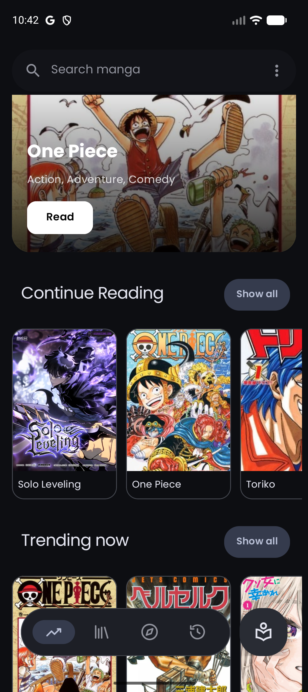
  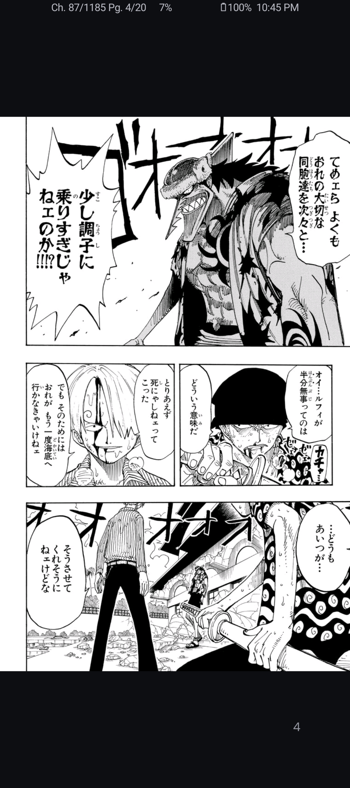
  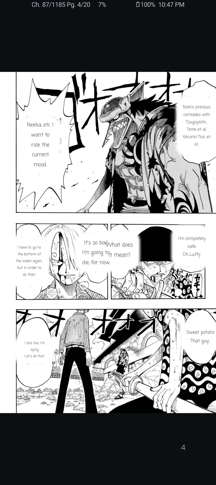
</p>

---

## About

Nyora is a polished, privacy-first manga reader for Android — a fork of [Kotatsu](https://github.com/KotatsuApp/Kotatsu) rebuilt around five things readers actually care about: translating a whole page of any language back over the original art, downloading chapters for offline reading, pulling from 1100+ built-in sources plus Tachiyomi/Mihon/Keiyoushi extensions, syncing your entire library across every device for free, and staying 100% open-source with no ads, no tracking and no account required to read. Read on your phone at lunch and pick up exactly where you left off on your laptop at night.

## Why You'll Love It

- **Read raws in your language, instantly.** Translation isn't a side feature — it's the headline. Tap once and the *whole page* is detected, translated and typeset back over the original art. No copy-paste, no cropping, no waiting on a scanlation that may never land.
- **Your library, everywhere, for free.** One free Nyora Cloud account (email + password) keeps your library, categories, history, bookmarks and exact reading progress in lockstep across Android, iOS, macOS, Windows, Linux and the Web. Switch devices mid-chapter; never lose your place.
- **Works on the train, on a flight, off-grid.** Download chapters with a tap, open CBZ archives you already own, and an on-device translation fallback keeps working with no connection.
- **Nothing watching you.** No ads, no trackers, no telemetry, no account to read. Sign-in exists *only* for optional sync. Because every line is open-source, you can verify exactly that.
- **Native, fast, and yours.** Built with Jetpack Compose and Material You, with AMOLED dark mode, app-lock and incognito reading. Your library is stored on your device and is yours to keep, export and move.

## Highlights

| Pillar | What it does |
|---|---|
| Translate | Detects every bubble and caption, translates the whole page, and typesets it back over the original artwork — with an on-device offline ML fallback. |
| Download | Save chapters with a tap for offline reading; open and read local CBZ archives too. |
| Sources | 1100+ built-in sources via the **data-driven engine** ([`nyora-data-driven`](https://github.com/Nyora-Manga/nyora-data-driven)) — 35 generic templates — plus native Tachiyomi / Mihon / Keiyoushi extension support. |
| Sync | Free Nyora Cloud sync of library, categories, history, bookmarks and exact reading progress across every platform. |
| Open Source | 100% free, ad-free, no tracking, no sign-up to read. Android app under GPLv3; rest of the ecosystem Apache-2.0. |

## Table of Contents

- [About](#about)
- [Why You'll Love It](#why-youll-love-it)
- [Highlights](#highlights)
- [Features](#features)
  - [Translate](#translate)
  - [Download & Offline](#download--offline)
  - [Sources & Discovery](#sources--discovery)
  - [Cloud Sync](#cloud-sync)
  - [Reader](#reader)
  - [Trackers](#trackers)
  - [Privacy & Open Source](#privacy--open-source)
  - [Themes & Personalisation](#themes--personalisation)
- [Capability Matrix](#capability-matrix)
- [Screenshots](#screenshots)
- [Installation](#installation)
- [Build from Source](#build-from-source)
- [Tech Stack](#tech-stack)
- [Architecture](#architecture)
- [Nyora on Every Platform](#nyora-on-every-platform)
- [Roadmap](#roadmap)
- [FAQ](#faq)
- [Contributing](#contributing)
  - [Ways to Contribute](#ways-to-contribute)
  - [Development Setup](#development-setup)
  - [Where Things Live](#where-things-live)
  - [Good First Contributions](#good-first-contributions)
  - [Pull Request & Issue Etiquette](#pull-request--issue-etiquette)
- [Acknowledgements](#acknowledgements)
- [License](#license)

## Features

### Translate

Translation is the headline feature. Tap translate and Nyora processes the **entire page at once**: it detects every speech bubble and caption, translates the text, and **typesets it back over the original artwork** so the page reads naturally in your language — panels, sound effects and all. No copy-pasting into another app, no manual cropping, no waiting on a scanlation that may never come.

When you are offline, or simply want everything to stay on-device, an **on-device offline ML fallback** keeps translation working with no network connection. That makes Nyora genuinely useful for raw chapters in any language: read the original art with translated text laid in place, wherever you are. Targets such as **English and Hindi** are supported, alongside the broader set of languages the translation engine handles.

### Download & Offline

Save chapters with a single tap and read on the train, on a flight, or anywhere the signal drops. Downloads are **yours to keep**, queued and managed in-app so you can batch large series and walk away while they finish. Saved chapters read with the same reader, gestures and per-title settings as online titles — nothing changes when you go offline. Nyora also **opens local CBZ archives**, so a collection you already own comes along for the ride and reads exactly like everything else.

### Sources & Discovery

Browse, search and filter across **1100+ built-in sources** spanning **manga, manhwa and manhua**. The source system runs on a **data-driven engine** ([`nyora-data-driven`](https://github.com/Nyora-Manga/nyora-data-driven)) — 35 generic engine templates (Madara, MangaReader, MangaBox, ZeistManga, etc.) that render runtime SourceDefs pulled from a published repo, dramatically simplifying source maintenance. When you want more, Nyora also speaks **Tachiyomi / Mihon / Keiyoushi** extensions natively — install the extension package you already use and its catalogues plug straight in. A new-chapter update feed keeps ongoing series fresh, recommendations tailored to your library help surface your next read, and a fast search box gets you to a specific title in seconds. Nyora hosts none of this content; it is a reader that talks to the sources you choose.

### Cloud Sync

Create a free **Nyora Cloud** account with just an **email and password** and your world follows you. Sync runs on Nyora's own **self-hosted backend** (no Google account, no third-party sign-in). Your **library, custom categories, reading history, bookmarks and exact reading progress** stay in lockstep across **Android, iOS, macOS, Windows, Linux and the Web**. Switch devices mid-chapter and you never lose your place. Sync is **opt-in and account-based** — it exists only to carry your own reading state between your own devices — and it is completely **free**, with no subscription and no premium tier gating it. Prefer to stay local? Never sign in and Nyora works fully offline.

### Reader

The reader supports both **standard and webtoon** modes with **LTR / RTL / vertical** orientations, smooth gestures, pinch zoom and **double-page** layout for spreads. Settings can be applied **per-title**, so a long-strip webtoon and a right-to-left manga each behave the way they should and remember it next time. **Dynamic colour correction** lets you tune brightness, contrast and colour live while reading — handy for low-contrast raws or reading in the dark. Volume-key paging and tap zones keep one-handed reading comfortable.

### Trackers

Keep your progress in sync with the services you already use. Nyora integrates with **AniList, MyAnimeList, Shikimori and Kitsu**, updating your lists as you read so your reading and your tracker stay consistent without manual edits. Trackers handle your public reading lists; Nyora's own cloud sync handles your full library state — the two work side by side.

### Privacy & Open Source

Nyora is **100% free and ad-free**, with **no tracking and no account required to read** — signing in is only for optional cloud sync. The app ships an **app-lock** (PIN or fingerprint) that gates the app behind your device biometrics, and an **incognito mode** for private reading sessions that are not written to history. Because the project is open-source, you can read every line and verify exactly what the app does. The Android app is licensed under **GPLv3**; the rest of the Nyora ecosystem is Apache-2.0.

### Themes & Personalisation

Choose **light, dark or system** themes, plus a true-black **AMOLED** mode that switches the UI to pure black to save power on OLED panels and ease night reading. The app follows **Material You** conventions for a clean, native Android feel, adapting accent colours to your wallpaper on supported versions. Your library stays organised with **favourites in custom categories**, history and bookmarks.

## Capability Matrix

A quick, honest snapshot of what the Android app does today.

| Capability | Android |
|---|---|
| Whole-page AI translation (typeset over art) | Yes |
| On-device offline translation fallback | Yes |
| Built-in sources | 1100+ |
| Tachiyomi / Mihon / Keiyoushi extensions | Native |
| Offline downloads | Yes |
| Local CBZ archive reading | Yes |
| Standard + webtoon reader | Yes |
| LTR / RTL / vertical, double-page | Yes |
| Per-title reader settings | Yes |
| Free cloud sync (Nyora Cloud account) | Yes |
| Trackers (AniList / MAL / Shikimori / Kitsu) | Yes |
| App-lock (PIN / fingerprint) | Yes |
| Incognito mode | Yes |
| AMOLED / Material You theming | Yes |
| Ads / tracking | None |
| Account required to read | No |

## Screenshots

### Phone

| | | |
|:-:|:-:|:-:|
| <br/>**Home** — A featured spotlight, Continue Reading and Trending Now the moment you open the app. | 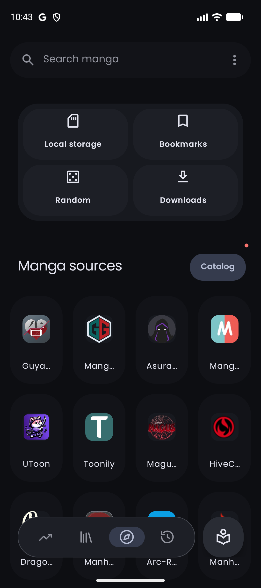<br/>**Explore** — Browse the full catalogue of online sources and pick where to read. | 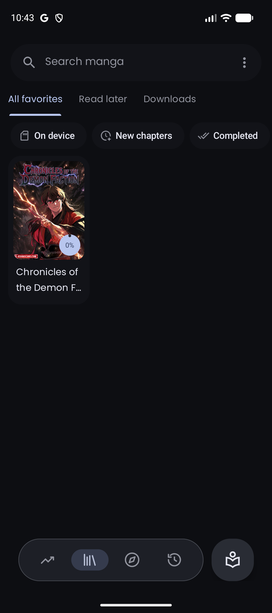<br/>**Library** — Your saved manga in custom categories, sorted however you like. |
| 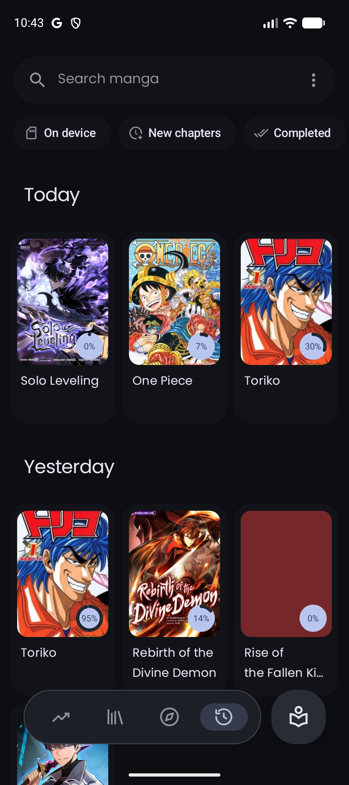<br/>**History** — Everything you have read recently, ready to pick back up. | 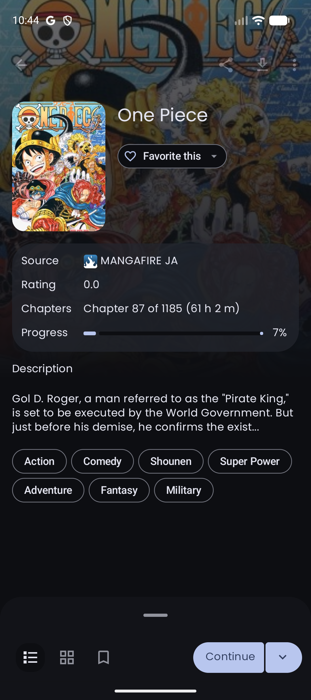<br/>**Details** — Cover, synopsis and the full chapter list for any title. | <br/>**Reader** — An immersive reader that melts away to just you and the page. |
| <br/>**AI translation** — Whole-page translation overlaid right onto the original art. | 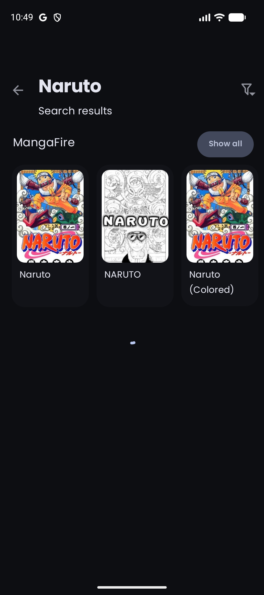<br/>**Search** — Search every installed source at once. | 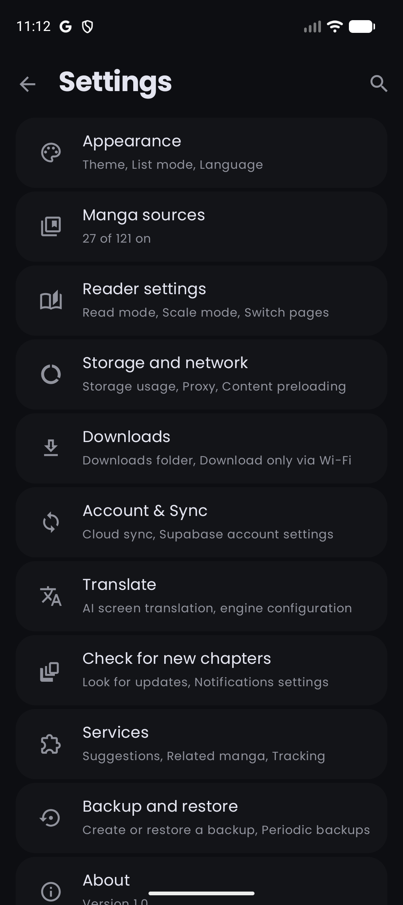<br/>**Settings** — Deep control over the reader, sources, sync and privacy. |

### Tablet

| | |
|:-:|:-:|
| 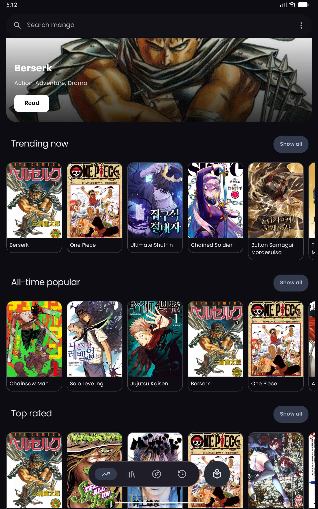<br/>**Home** — A featured spotlight over Trending Now, All-Time Popular and Top Rated rows. | 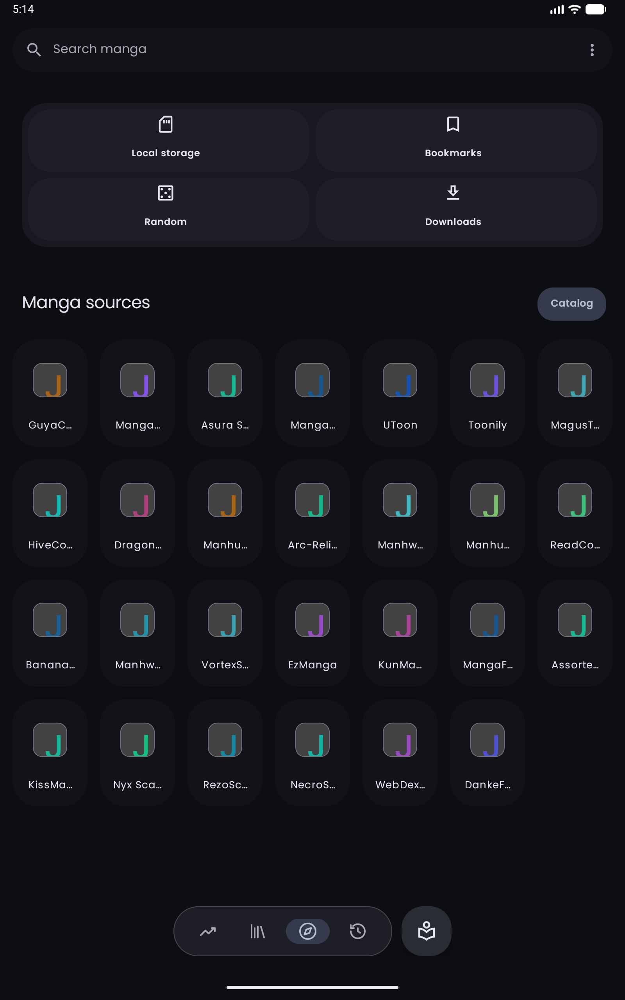<br/>**Explore** — Local, Bookmarks, Random and Downloads shortcuts above the full grid of sources. |
| 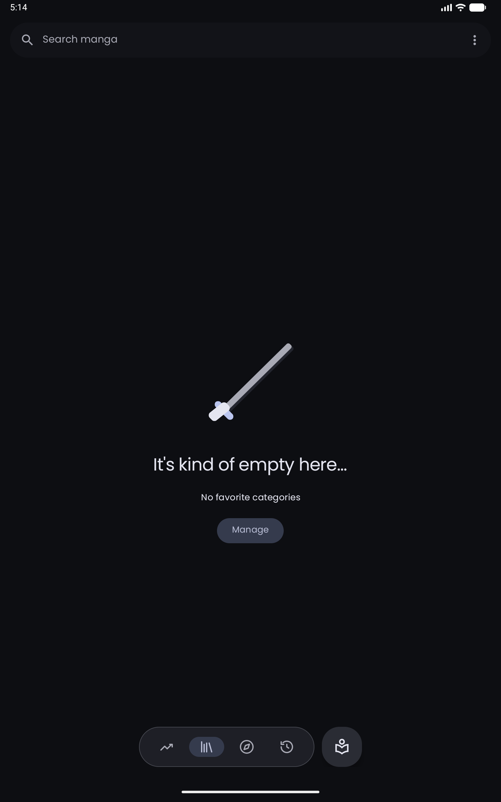<br/>**Favourites** — Favourites organised into the categories you control. | 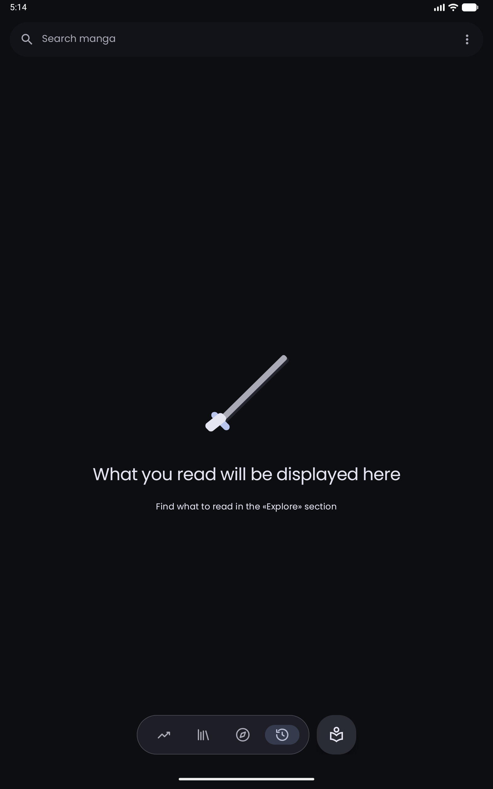<br/>**History** — Your recent reading, with room to breathe on a bigger screen. |
| 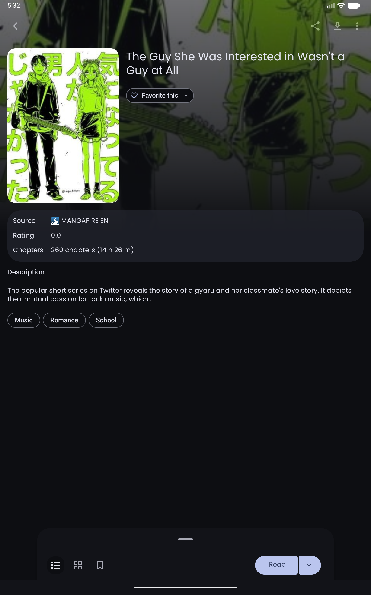<br/>**Details** — Cover, source, rating, genre tags and the full chapter list. | 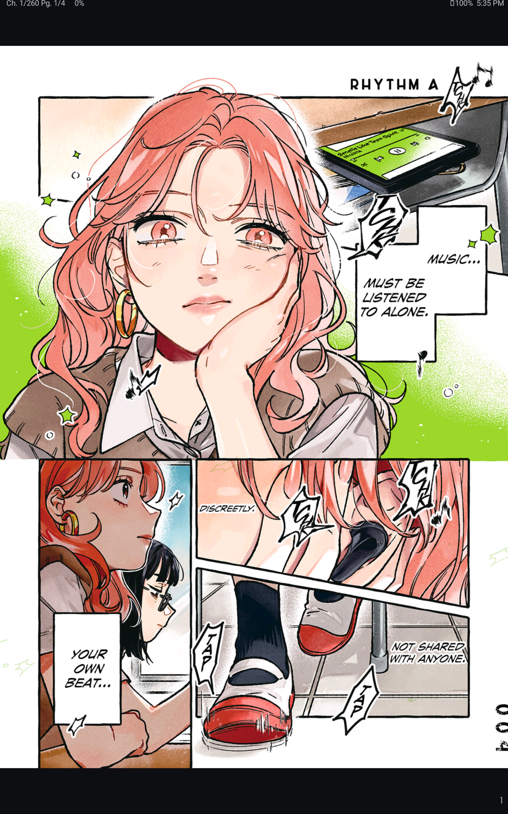<br/>**Reader** — A full-colour page in the immersive reader, with chapter and page progress. |
| 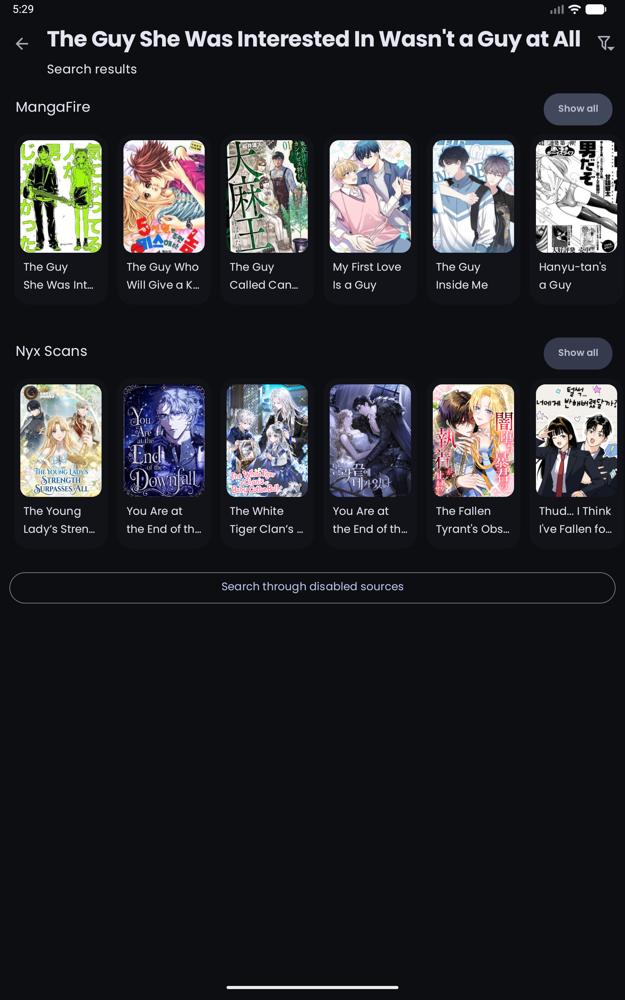<br/>**Search** — Global search results grouped by source. | 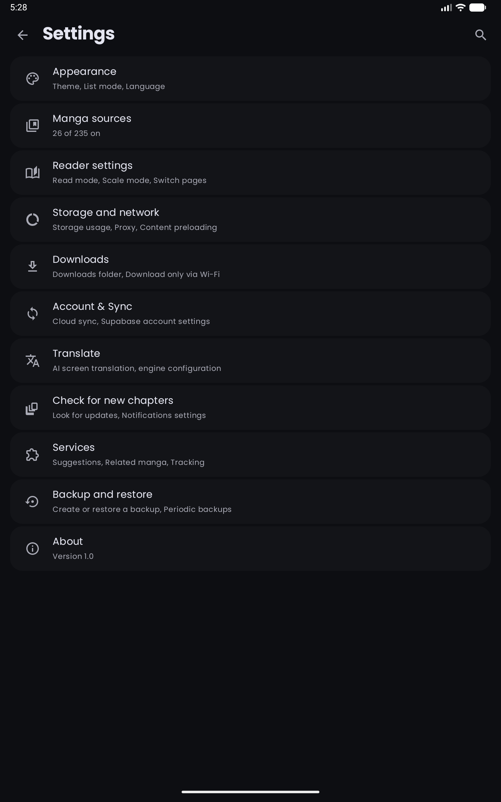<br/>**Settings** — Appearance, sources, reader, translation, sync and backup. |

## Installation

Installing Nyora takes about a minute. It is the **signed release APK** — open-source, auditable, with **no ads, no tracking and no account required to read**. Nyora is distributed outside the Play Store, so Android will ask for a one-time permission to install it. That prompt is **normal and expected** for any app installed from a browser — you are simply telling Android you trust this file. Below is exactly what to tap and why.

**Requirements**

- Android **6.0 (Marshmallow)** or newer
- Works on phones and tablets

**Steps**

1. Open the **[Releases page](https://github.com/Nyora-Manga/nyora-android/releases/latest)** and download the latest `nyora-*.apk`.
2. Open the downloaded file. If this is your first sideloaded app, Android will prompt you to **allow installs from your browser (or file manager)** — this is the expected one-time permission for apps not from the Play Store. Grant it and continue.
3. Confirm the install and launch Nyora.

That's it — no sign-up, no onboarding wall. Start reading immediately; sign in later only if you want cloud sync.

**Updating**

Newer releases are published on the same Releases page. Download and install the new APK over your existing install — your library, downloads and settings are preserved, and if you use cloud sync your library is also restored on a fresh install once you sign in to your Nyora Cloud account.

**Troubleshooting**

- *"App not installed" / blocked by Play Protect*: choose **Install anyway** when prompted. Nyora is sideloaded and is not distributed through the Play Store; Play Protect flags any non-Store app, so this is expected.
- *Install permission missing*: go to **Settings → Apps → Special access → Install unknown apps**, select the browser or file manager you used, and enable it, then retry.

## Build from Source

**Prerequisites**

- **Android Studio**
- **JDK 17**

**Build**

```bash
git clone https://github.com/Nyora-Manga/nyora-android.git
cd nyora-android
./gradlew assembleRelease   # or open in Android Studio and Run ▸ app
```

The release APK is produced under the app module's build outputs. You can also open the project in Android Studio and use **Run ▸ app** to build and deploy a debug build to a connected device or emulator.

> Good news for contributors: the Android app builds from this public repo with no private dependencies — the 1100+ sources are pulled in as a published data-driven engine library (`com.github.Nyora-Manga:nyora-data-driven`) via JitPack, with an optional local composite build for fast iteration. Clone, build and run today. See [Development Setup](#development-setup) for the contributor-oriented quickstart.

## Tech Stack

<p>
  
  
  
  
  
  
  
  
  
  
  
</p>

- **Kotlin 2.2** — the app is written entirely in Kotlin, targeting modern Android.
- **Android** — native app supporting **Android 6.0+ (API 23)** through **Android 16 (API 36)** on phones and tablets.
- **Gradle 9.3 / AGP 9.1** — build system; release builds via `./gradlew assembleRelease`.
- **Hybrid UI** — **Jetpack Compose** (BOM 2026.03) for modern declarative screens + **XML layouts** with ViewBinding for the established reader and browsing surfaces. Material You theming with light/dark/AMOLED.
- **Hilt 2.57** — dependency injection throughout the app.
- **Room 2.7** — local database with 32 migrations covering manga, history, favourites, categories, bookmarks, tracks and more.
- **OkHttp 5.2** — networking with DNS-over-HTTPS, Conscrypt TLS 1.3 for older Android, Cloudflare bypass, rate limiting and image proxy interceptors.
- **Coil 3** — image loading with AVIF, GIF and SVG decoder support.
- **ML Kit** — on-device OCR for Latin, Japanese, Chinese and Korean text recognition, plus language ID and translation.
- **ONNX Runtime 1.20** — on-device manga colorization model execution.
- **Nyora Cloud** — self-hosted sync backend (email + password, OAuth2 + JWT) with Google sign-in option.
- **Sentry** — crash reporting and performance monitoring.
- **QuickJS-KT** — JavaScript runtime for parser execution.
- **Data-driven engine** ([`nyora-data-driven`](https://github.com/Nyora-Manga/nyora-data-driven)) — 35 generic source templates consumed as a local composite build or via JitPack.

## Architecture

Nyora for Android is a fork of [Kotatsu](https://github.com/KotatsuApp/Kotatsu), inheriting its mature reader engine and source architecture and layering Nyora's pillars on top.

- **Sources layer** — 1100+ built-in sources powered by the **data-driven engine** ([`nyora-data-driven`](https://github.com/Nyora-Manga/nyora-data-driven)): 35 generic engine templates (Madara, MangaReader, MangaBox, ZeistManga, etc.) that render runtime SourceDefs from a published repo. Combined with native compatibility for **Tachiyomi / Mihon / Keiyoushi** extensions, the existing extension ecosystems work without conversion. The engine is consumed as a local composite build during development or via JitPack for CI/release builds.
- **Reader engine** — a tuned image reader handles standard and webtoon modes, multiple orientations, zoom, double-page layout and live colour correction, with per-title settings persisted locally.
- **Translation pipeline** — whole-page detection, translation and typesetting render translated text back over the original artwork, with an **on-device offline ML fallback** (ML Kit OCR + ONNX Runtime) so the feature works without a network connection.
- **Offline & local files** — a download manager queues and stores chapters for offline reading, and the same reader opens local **CBZ** archives.
- **Cloud sync** — signing in to a **Nyora Cloud** account (email + password) synchronises library, categories, history, bookmarks and reading progress across all Nyora platforms, so state is consistent on every device. Sync talks to Nyora's self-hosted backend (OAuth2 password flow + JWT), not any third-party service.
- **Privacy surfaces** — app-lock (PIN/fingerprint) and incognito mode are built in; no tracking is performed and no account is required for local-only reading.

## Nyora on Every Platform

| Platform | Repo | Get it |
|---|---|---|---|
| Android | **nyora-android** *(you are here)* | [APK](https://github.com/Nyora-Manga/nyora-android/releases/latest) |
| Windows | [nyora-windows](https://github.com/Nyora-Manga/nyora-windows) | [.exe (x64/ARM64)](https://github.com/Nyora-Manga/nyora-windows/releases/latest) |
| macOS | [nyora-mac](https://github.com/Nyora-Manga/nyora-mac) | [.dmg / `brew`](https://github.com/Nyora-Manga/nyora-mac/releases/latest) |
| Linux | [nyora-linux](https://github.com/Nyora-Manga/nyora-linux) | [deb · rpm · curl](https://github.com/Nyora-Manga/nyora-linux/releases/latest) |
| iOS / iPadOS | [nyora-ios](https://github.com/Nyora-Manga/nyora-ios) | [sideload IPA](https://github.com/Nyora-Manga/nyora-ios/releases/latest) |
| Data-driven engine | [`nyora-data-driven`](https://github.com/Nyora-Manga/nyora-data-driven) | Published to JitPack |
| Web | — | [web.nyora.xyz](https://web.nyora.xyz) |

All platforms share one synced library, categories, history, bookmarks and exact reading progress through the same free Nyora Cloud account.

## Roadmap

Honest, already-stated directions for the wider Nyora family — no dates, no promises:

- **iOS** — a signed TestFlight build is planned and will follow the current sideloaded IPA.
- **Source parity** — continued expansion and parity work across newer source ports.

## FAQ

**Is Nyora free? Are there ads?**
Yes, it is 100% free and completely ad-free. There is no premium tier, no subscription and no tracking.

**Is it safe? Why does Android warn me / why is it "unknown sources"?**
Nyora is distributed as a **signed APK** outside the Play Store, so the first time you install it Android asks you to allow installs from your browser or file manager. That prompt — and any Play Protect warning — is **standard for every non-Store app**; it is not specific to Nyora and does not mean anything is wrong. Because Nyora is fully open-source, you (or anyone) can read every line and even build the APK yourself to confirm it matches the release. Choose **Install anyway** when prompted.

**Do I need an account?**
No account is required to read. A free Nyora Cloud account (email + password) is only for optional cloud sync of your library and progress.

**Will my data be private?**
Yes. There are no ads and no tracking, and reading never requires an account. Your library, history and downloads live on your device. If you opt into sync, it carries only your own reading state (library, categories, history, bookmarks, progress) between your own devices via your Nyora Cloud account — nothing more.

**How do I update?**
Download the newest APK from the [Releases page](https://github.com/Nyora-Manga/nyora-android/releases/latest) and install it over your existing version. Your library, downloads and settings are preserved, and cloud sync restores your library after a fresh install once you sign back in to your Nyora Cloud account.

**Where does the content come from?**
Nyora hosts no manga. It accesses 1100+ built-in sources and is compatible with Tachiyomi / Mihon / Keiyoushi extensions — it is a reader, not a host, and is not affiliated with any of the sources it can access.

**Are my existing extensions compatible?**
Yes. Nyora supports Tachiyomi / Mihon / Keiyoushi extensions natively, so the extension packages you already use plug straight in without conversion.

**Does cloud sync need an account, and is it private?**
Sync is opt-in and tied to your own free Nyora Cloud account (email + password), running on Nyora's self-hosted backend rather than any third-party service. It carries only your library, categories, history, bookmarks and reading progress between your own devices. Reading itself never requires an account — you only sign in if you want sync.

**Can I read offline?**
Yes. Download chapters in-app for offline reading, and open local CBZ archives you already own. An on-device offline ML translation fallback also works without a connection.

**Which Android versions are supported?**
Android 6.0 and newer, on both phones and tablets.

**Which other platforms share my library?**
Android, Windows, macOS, Linux, iOS/iPadOS and the Web — all sync the same library and progress. See [Nyora on Every Platform](#nyora-on-every-platform).

## Contributing

[](https://github.com/Nyora-Manga/nyora-android/pulls)

Nyora is built in the open, and contributions of every size and skill level are genuinely welcome — you do **not** need to be an Android developer to help, and you can start today. This section is here to make that first step easy.

If you only do one thing: open the [Issues](https://github.com/Nyora-Manga/nyora-android/issues) tab, find something that interests you, and say hello. We try to keep the project approachable and kind.

### Ways to Contribute

There is a place for everyone here — coders and non-coders alike:

- **Report a bug.** Hit something broken? Open a [bug report](https://github.com/Nyora-Manga/nyora-android/issues/new/choose) — the issue form walks you through the few details we need (app version, Android version, steps). Clear bug reports are one of the most valuable contributions there is.
- **Suggest a feature.** Have an idea? File a feature request through the [issue templates](https://github.com/Nyora-Manga/nyora-android/issues/new/choose) and tell us the problem you're trying to solve.
- **Translate the UI.** Nyora's strings are translated through **Weblate** at [hosted.weblate.org/engage/Nyora](https://hosted.weblate.org/engage/Nyora) — no code, no setup, just pick your language and start. (Please use Weblate rather than editing string resources by hand, so translations stay in sync.)
- **Help with sources.** The 1100+ sources come from the Kotatsu-style parsers project. If a source breaks or you'd like to propose a new one, that work happens upstream in the parsers repository: [kotatsu-parsers-redo](https://github.com/kotatsu-redo/kotatsu-parsers-redo). Reporting a broken source there (with the site and what failed) is a real, welcome contribution.
- **Improve the docs.** Spot something unclear in this README or want to add a how-to? Docs PRs are some of the friendliest first contributions.
- **Test releases.** Try the latest release (or a [nightly build](https://github.com/Nyora-Manga/nyora-android/releases)) on your device and report what works and what doesn't — especially on less common phones, tablets and Android versions.
- **Star and share.** Genuinely one of the most helpful things you can do — [star the repo](https://github.com/Nyora-Manga/nyora-android/stargazers) and tell a friend who reads manga. It costs nothing and helps the project reach more readers and contributors.

> **Looking for a bigger, high-impact project?** The largest open contributor opportunity in the Nyora family right now is **NyoraEngine**, the iOS source engine in [nyora-ios](https://github.com/Nyora-Manga/nyora-ios). Its framework is built and one source template is complete, but of roughly **3,659 classes** and **~1,331 parsers**, around **1,300 sources** still need porting — and they're mostly **mechanical template subclasses**, which makes the work highly parallelisable and ideal for many contributors working at once. If you know (or want to learn) Swift, that's the headline "help wanted." See the iOS repo for the current status and how to claim a batch.

### Development Setup

This is the contributor quickstart for hacking on the **Android app** itself (distinct from the end-user [Build from Source](#build-from-source) steps).

**Prerequisites**

- **Android Studio** (latest stable)
- **JDK 17**

**Clone, build and run**

```bash
git clone https://github.com/Nyora-Manga/nyora-android.git
cd nyora-android
./gradlew assembleDebug      # builds a debug APK
```

Then open the project in Android Studio and use **Run ▸ app** to deploy a debug build to a connected device or emulator. The app builds from this public repo with **no private dependencies** — the sources are pulled in as a published parsers library (`com.github.clquwu:kotatsu-parsers-redo`), so you get a working build without any special access.

**Useful tasks**

- `./gradlew assembleDebug` — debug APK
- `./gradlew test` — run the unit tests
- The project uses Hilt (DI), Room (database), OkHttp + Coil (networking & images), Jetpack Compose and Material You. minSdk is Android 6.0; compileSdk targets current Android.

**Testing against a specific parsers build** (optional, advanced): the sources library version is pinned in Gradle, and you can override it for a build to test newer parser changes, e.g.:

```bash
./gradlew assembleDebug -DparsersVersionOverride=<short-sha>
```

### Where Things Live

The app follows a **package-per-feature** layout, so you can usually find a screen or capability by its name. Code lives under `app/src/main/kotlin/com/nyora/hasan72341/…`:

- `reader/` — the reading experience (standard & webtoon modes, gestures, colour correction)
- `details/` — the manga details screen
- `explore/`, `search/`, `discover/`, `filter/` — browsing, searching and filtering sources
- `library/`, `favourites/`, `history/`, `bookmarks/` — your saved library and reading state
- `download/`, `local/` — offline downloads and local CBZ reading
- `sync/`, `backups/`, `scrobbling/`, `tracker/` — cloud sync, backups and trackers
- `ai/` — the translation feature surfaces
- `tachiyomi/`, `mihon/` — Tachiyomi / Mihon / Keiyoushi extension compatibility
- `settings/` — all settings screens (reader, sources, protection, about, …)
- `core/` — shared infrastructure (database, network, parser glue, prefs, UI, utils)

UI strings are managed through **Weblate** (see [Ways to Contribute](#ways-to-contribute)); please don't edit string resources by hand. The repository also ships **issue templates** (bug report and feature request) under `.github/ISSUE_TEMPLATE/`, and CI builds run on pull requests so you (and reviewers) can be confident a change compiles.

### Good First Contributions

If you're not sure where to begin, these tend to be approachable and genuinely useful:

- **File a great bug report** for something you've personally hit — small, specific and reproducible.
- **A small UI fix or polish** — fix an alignment issue, a wrong string, a theming glitch in light/dark/AMOLED, or improve an accessibility label. The package-per-feature layout above makes these easy to locate.
- **Docs improvements** — clarify a confusing step, fix a typo, or add a short how-to.
- **A translation** in your language via Weblate — zero code required.
- **Report or propose a source** in the upstream [parsers repo](https://github.com/kotatsu-redo/kotatsu-parsers-redo), where source code actually lives. The parser project is built around reusable templates (Madara, MangaReader and friends), so adding a new site is often a small, mechanical subclass — a great way to make a visible impact.

### Pull Request & Issue Etiquette

A few simple norms keep reviews fast and friendly:

- **Keep PRs focused.** One change per PR is much easier to review than a mixed bag. If you find yourself touching unrelated things, split them.
- **Describe the change.** Say what it does and why; link the issue it addresses if there is one. Screenshots help enormously for UI changes.
- **Match the surrounding style.** Follow the existing patterns in the file you're editing; prefer Weblate for strings and avoid adding heavy dependencies (APK size matters).
- **Be kind.** We review each other's work generously and assume good intent. New contributors are explicitly welcome — ask questions if you're stuck.
- Start from the [Issues](https://github.com/Nyora-Manga/nyora-android/issues) page, and open your work as a [Pull Request](https://github.com/Nyora-Manga/nyora-android/pulls).

Thank you for being here — whether you fix a typo, file one good bug, translate a screen, or port a hundred sources, you make Nyora better for every reader. And if all you do is [star the repo](https://github.com/Nyora-Manga/nyora-android/stargazers) and share it with a friend who reads manga, that genuinely helps too. Welcome aboard.

## Acknowledgements

Nyora for Android is built on the excellent [Kotatsu](https://github.com/KotatsuApp/Kotatsu) reader, and stands on the work of its maintainers and contributors. Thanks also to the Tachiyomi / Mihon / Keiyoushi extension communities, and to everyone who reports issues and contributes improvements.

Developed and maintained by **Md Hasan Raza** — [GitHub](https://github.com/Hasan72341) · [Instagram](https://instagram.com/md_hasan_raza____) · [LinkedIn](https://www.linkedin.com/in/md-hasan-raza) · hasanraza96@outlook.com

## License

Licensed under the **GNU General Public License v3.0** — see [`LICENSE`](LICENSE). Nyora for Android is a fork of [Kotatsu](https://github.com/KotatsuApp/Kotatsu).

> Nyora is not affiliated with any of the manga sources it can access.